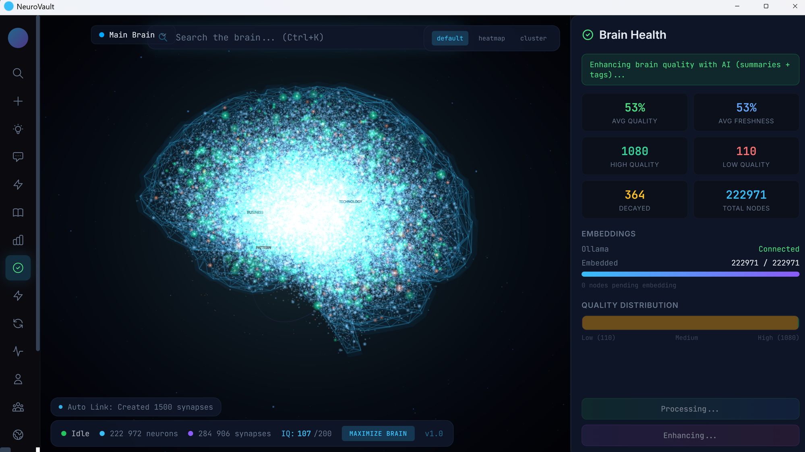

# NeuroVault

[](LICENSE)
[](https://github.com/hein4793/neurovault/actions/workflows/ci.yml)
[](https://github.com/hein4793/neurovault/releases)
[](https://github.com/hein4793/neurovault/stargazers)

**A self-evolving 3D knowledge brain that runs entirely on your machine.**

No cloud. No accounts. No telemetry.

NeuroVault is a desktop knowledge management system that ingests your notes, code, conversations, and documents, then organizes them into a living 3D knowledge graph that grows smarter over time through autonomous circuits.

<p align="center">
  
  <br />
  <em>222,972 neurons, 284,906 synapses, IQ 107/200 -- the brain grows and self-improves 24/7</em>
</p>

---

## Features

- **3D Knowledge Graph** -- Interactive Three.js visualization of your entire knowledge base. Fly through your brain, click nodes, explore connections.
- **31 Autonomous Circuits** -- Background processes that continuously improve your knowledge: cross-domain fusion, quality scoring, gap detection, pattern mining, curiosity-driven research, and more.
- **IQ Scoring** -- A composite intelligence metric that tracks how connected, deep, and useful your knowledge is. Watch it climb as the brain self-improves.
- **Semantic Search** -- HNSW vector index + FTS5 full-text search. Find anything instantly by meaning, not just keywords.
- **MCP Integration** -- Ships with an MCP server that bridges your AI assistant directly to your brain. Your AI coding assistant remembers everything.
- **Phase Omega Systems**:
  - **Digital Twin** -- A self-model that tracks the brain's own strengths, weaknesses, and improvement priorities.
  - **Agent Swarm** -- Spawn autonomous research agents that investigate topics and report back.
  - **World Model** -- Tracks entities, relationships, and predictions about the external world.
  - **Self-Improvement** -- The brain identifies its own gaps and autonomously fills them.
  - **Economic Autonomy** -- Tracks the value the brain generates vs. its compute costs.
  - **Multi-Brain Federation** -- Share knowledge between NeuroVault instances.
  - **Sensory Expansion** -- Ingest images, audio, screenshots, and live data streams.
- **Obsidian-Style Vault** -- Every node is also a plain markdown file with YAML frontmatter. Your data is always yours.
- **Fine-Tuning Pipeline** -- Export your knowledge as training data and fine-tune a local LLM that thinks like you.
- **Proactive Sidekick** -- Watches your AI assistant sessions and injects relevant context automatically.
- **Dual-Brain Architecture** (NEW):
  - **6-Layer Context Bundle** -- Rules, knowledge (MMR-selected), work patterns, decisions, warnings, and predictions compressed to ~4000 tokens and injected into every AI session.
  - **Bidirectional Learning** -- Your AI assistant can teach the brain decisions, patterns, and mistakes via 5 new MCP tools.
  - **Cross-Session Continuity** -- Session summaries capture decisions, code written, open questions, and next steps so your AI picks up exactly where you left off.
  - **Context Quality Tracking** -- Measures how useful injected context is and self-optimizes relevance rankings over time.
  - **Anticipatory Loading** -- Predicts what context you'll need next based on project, time of day, and pending research.
  - **Dream Mode** -- Overnight deep synthesis (5-pass reasoning) and morning briefings compiled before you wake up.
- **Power Management** (NEW):
  - **Per-inference energy telemetry** -- Every LLM call logs duration, tokens, backend, and estimated Wh to a local `inference_log` table; `GET /metrics/power` returns per-circuit rollups with annualized-kWh projection.
  - **Dual-backend routing** -- Optional second Ollama daemon runs CPU-only inference (~80 W) for background circuits while interactive calls stay on the GPU (~300 W). Profile-based auto-routing picks the right backend per circuit; no manual wiring.
  - **Adaptive policy** -- On-battery detection via `kernel32` flips the brain into Eco mode automatically and demotes every call to CPU; returns to Normal when plugged back in.
  - **Model tiering** -- `llm_model_cpu` setting lets CPU routes use a smaller model (e.g. Qwen 3B) so batch circuits don't stall on a 14 B model at 1 tok/s.
  - See [`docs/POWER_PLAN.md`](docs/POWER_PLAN.md) for the full phase-by-phase rollout.

## Quick Start

### Download

Pre-built binaries for Windows, macOS, and Linux are available on the [Releases](https://github.com/hein4793/neurovault/releases) page.

### Build from Source

**Prerequisites:**
- [Node.js](https://nodejs.org/) >= 18
- [pnpm](https://pnpm.io/)
- [Rust](https://rustup.rs/) (latest stable)
- [Ollama](https://ollama.ai/) (for local LLM and embeddings)

```bash
# Clone the repo
git clone https://github.com/hein4793/neurovault.git
cd neurovault

# Install frontend dependencies
pnpm install

# Pull the embedding model
ollama pull nomic-embed-text

# Run in development mode
pnpm tauri dev

# Or build for production
pnpm tauri build
```

### Docker (Headless Mode)

```bash
docker run -d \
  -p 17777:17777 \
  -v ~/.neurovault:/root/.neurovault \
  neurovault/neurovault:latest
```

The headless binary runs the autonomy engine + HTTP API without the desktop GUI, ideal for servers.

## Tech Stack

| Layer | Technology |
|-------|-----------|
| Desktop Shell | Tauri v2 |
| Frontend | React 19 + Three.js + Zustand |
| Backend | Rust (Tokio async runtime) |
| Database | SQLite + FTS5 (bundled, zero-config) |
| Vector Search | HNSW (instant-distance, pure Rust) |
| LLM / Embeddings | Ollama (local) or Anthropic API |
| MCP Bridge | Node.js stdio server |

## Why NeuroVault?

| Feature | NeuroVault | Obsidian | AnythingLLM | Mem0 | Khoj |
|---------|-----------|----------|-------------|------|------|
| Fully local (no cloud) | ✅ | ✅ | ✅ | ❌ | Partial |
| Knowledge graph | ✅ | Plugin | ❌ | ❌ | ❌ |
| Self-improving AI | ✅ (36 circuits) | ❌ | ❌ | ❌ | ❌ |
| 3D visualization | ✅ | ❌ | ❌ | ❌ | ❌ |
| IQ scoring | ✅ | ❌ | ❌ | ❌ | ❌ |
| MCP integration | ✅ | ❌ | ❌ | ❌ | ❌ |
| PDF/DOCX ingestion | ✅ | ✅ | ✅ | ❌ | ✅ |
| Embedded DB | ✅ (SQLite) | ✅ | ✅ | ❌ | ❌ |
| Agent swarm | ✅ | ❌ | ❌ | ❌ | ❌ |
| Cognitive fingerprint | ✅ | ❌ | ❌ | ❌ | ❌ |

## Architecture

### 36 Self-Improvement Circuits

| Category | Circuits | Purpose |
|----------|----------|---------|
| **Core** | quality_recalc, auto_link, iq_boost, synapse_prune | Graph maintenance |
| **Cognition** | meta_reflection, user_pattern_mining, self_synthesis, self_assessment | Learn about the user |
| **Research** | curiosity_gap_fill, cross_domain_fusion, knowledge_synthesizer | Discover new knowledge |
| **Reasoning** | contradiction_detector, hypothesis_tester, prediction_validator, decision_memory_extractor | Build logical models |
| **Phase Omega** | fingerprint_synthesis, internal_dialogue, swarm_orchestrator, temporal_analysis, causal_model_builder, knowledge_compiler, circuit_optimizer, capability_tracker, self_reflection, attention_update, curiosity_v2, federation_sync, cluster_health_check, economic_audit, scenario_simulator, code_pattern_extractor, compression_cycle | Advanced autonomy |
| **Dual-Brain** | session_summarizer, context_quality_optimizer, anticipatory_preloader, deep_synthesis, morning_briefing | AI bridge intelligence |

Every 20 minutes, one circuit fires. The brain gets smarter while you sleep. Dream mode circuits run overnight for deep synthesis; morning briefings compile discoveries before you wake up.

### Data Layout

```
~/.neurovault/
  data/brain.db                  # SQLite database (WAL mode)
  data/hnsw.bin                  # HNSW vector index
  vault/                         # Markdown files (Obsidian-compatible)
  export/
    active-context.md            # 6-layer context bundle (updated every 30s)
    session-handoff.md           # Last session summary for continuity
    morning-briefing.md          # Overnight discoveries briefing
    anticipatory-context.md      # Predicted next-task context
    brain-briefing.md            # IQ + stats + domains
    brain-index.json             # Machine-readable metadata
    nodes/                       # Top nodes as markdown
  finetune/                      # Training scripts and datasets
  backups/                       # Automated backups
```

## MCP Server

NeuroVault ships with an MCP server that lets your AI assistant query your brain directly:

```json
{
  "mcpServers": {
    "neurovault": {
      "command": "node",
      "args": ["/path/to/neurovault/mcp-server/src/index.js"]
    }
  }
}
```

Available tools: `brain_recall`, `brain_context`, `brain_preferences`, `brain_decisions`, `brain_learn`, `brain_health`, `brain_stats`, `brain_critique`, `brain_history`, `brain_export_subgraph`, `brain_plan`, `brain_warnings`, `brain_rules`, `brain_learn_decision`, `brain_learn_pattern`, `brain_learn_mistake`.

## Community Circuits

NeuroVault's circuit system is extensible. Community-contributed circuits can add new autonomous behaviors to your brain:

- **Circuit format**: Each circuit is a Rust module implementing the circuit trait
- **Installation**: Drop circuit files into `src-tauri/src/circuits/` and register them
- **Sharing**: Publish circuits as standalone crates or submit PRs to this repo

See [CONTRIBUTING.md](CONTRIBUTING.md) for details on writing custom circuits.

## Privacy & Security

**Your data never leaves your machine.**

- No cloud services, no accounts, no telemetry
- All AI processing runs locally via Ollama
- SQLite database stored in `~/.neurovault/`
- HTTP API bound to localhost only (127.0.0.1)
- CORS restricted to local origins
- Rate limiting and input validation on all endpoints

See [SECURITY.md](SECURITY.md) for vulnerability reporting.

## Documentation

- [INSTALL.md](docs/INSTALL.md) — platform-by-platform install walkthrough
- [ARCHITECTURE.md](docs/ARCHITECTURE.md) — how the system fits together
- [CIRCUIT_CATALOG.md](docs/CIRCUIT_CATALOG.md) — every circuit, what it does, how it fails
- [CIRCUIT_GUIDE.md](docs/CIRCUIT_GUIDE.md) — authoring guide for new circuits
- [MCP_INTEGRATION.md](docs/MCP_INTEGRATION.md) — wire the brain into your AI assistant
- [API_REFERENCE.md](docs/API_REFERENCE.md) — HTTP API reference
- [TROUBLESHOOTING.md](docs/TROUBLESHOOTING.md) — when things go wrong

## Contributing

Contributions are welcome! Whether it's bug fixes, new circuits, UI improvements, or documentation:

1. Fork the repo
2. Create a feature branch (`git checkout -b feature/my-circuit`)
3. Commit your changes
4. Push to your fork and open a Pull Request

Please see [CONTRIBUTING.md](CONTRIBUTING.md) for coding standards and architecture guidelines.

## License

[MIT](LICENSE)
